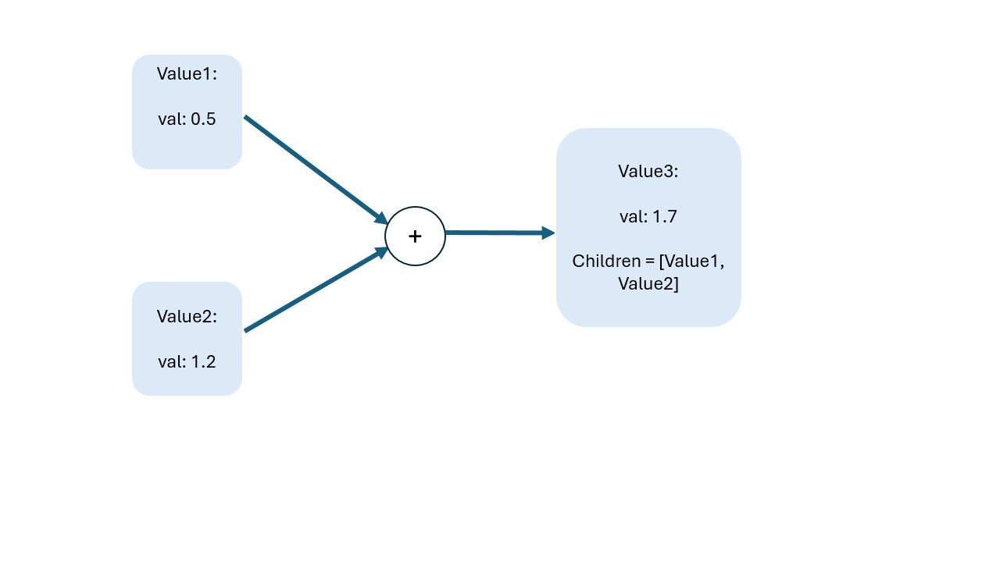
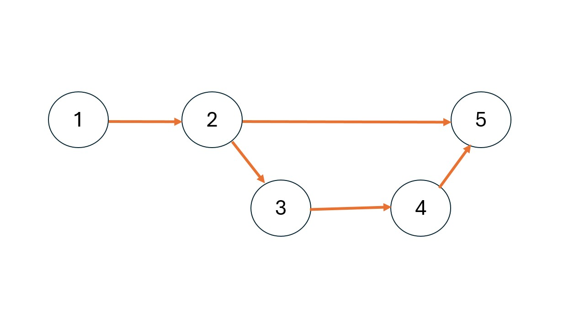

# Dust Autograd Engine


[](LICENSE)
[](https://github.com/username/project/actions)

## Description
This repository implements a basic AutoGrad Engine purely in python without utilizing any 3rd party frameworks such as numpy. It works on a scalar level, using the class Value.


## Table of Contents
- [The _Value_ object](#the-value-object)
- [The Computational Graph and topological ordering](#the-computational-graph-and-topological-ordering)
- [The _Value.backward()_ function](#the-value.backward()-function)
- [The _backward\_func_ attribute of Value objects](#the-backward-func-attribute-of-value-objects)

- [License](#license)

## The _Value_ object

The Value object has the following structure
``` python
class Value(object):
    '''
    Value Object:
        arguments:
            - x: input data of type int or float
        output:
            - Value object with value = x
    '''
    def __init__(self, x, children=[], requires_grad=False):
        self.children = children
        self.backward_func = None
        self.grad = 0.0
        self.requires_grad = requires_grad

    # Returns Value object's float value
    def value(self):
        return self.val
    
    ## Operator overloading for all Python basic operators
    ## e.g.
    def __neg__(self):
        # Return a new Value instance with the negated value
        return Value(-self.val, [self])
    
    # backward first creates a list of topologically ordered elements of the computational graph
    # Then for each of this nodes calls the backward_func 
    # to fill in the respective gradients of the children
    def backward(self):
        self.grad = 1.0
        # -- Get topological ordering with respect to self
        topo = list(reversed(get_topological_order(self)))
        for node in topo:
            if isinstance(node, type(self)):
                if node.backward_func is not None:
                    grad = node.grad
                    grads = node.backward_func(grad)
                    for i, child in enumerate(node.children):
                        if isinstance(child, type(self)):
                            child.grad += grads[i]
                else:
                    continue

```

Each value object has the following attributes:
1. children: A Python List containing Value() objects that produce the parent Value() object when combined with an operator or function
  E.g
  <p align="center">
  
  </p>
2. backward_func: An object that receives a cache saving useful information from the forward pass and implements a backward(grad) call where it transmits the receive grad to the children nodes

3. grad: The accumulated gradient for the particular scalar Value() object

4. requires_grad: Whether or not the particular node requires gradient accumulation

The value object also has the following functions:

1. All operator overloading functions for all primitive python operators such as +, -, * etc.

2. value(self): Which returns the current value of the Value() object in a Python float type

3. backward(self): Which first extracts a topologically ordered list of nodes of the computational graph and then iterates over them to accumulate gradients for all the nodes of the graph

## The Computational Graph and topological ordering

Each backward() call of a given Value() object first creates a topologically ordered list of the given computational graph. It does so to prevent another Value() node from calling its backward_func when It hasn't accumulated all the gradients from all the possible paths leading to the particular node. Let us demonstrate this failure case with an example.

Assume you have constructed the following computational graph:

<p align="center">
  
</p>

If you don't first sort the nodes in a Topologically order way, it could be the case that the traversal of the graph in the backward() call would be of the following order:

``` python
order = [Node5, Node2, Node4, Node3, Node1]
```

However this has disastrous results since _Node2_ would call its _backward\_func_ even though gradients from Nodes 3 and 4 have not been accumulated.

Topologically ordering the above graph means that each pair of nodes from the ordered list respects its order, leading to the following list of objects:

``` python
order = [Node5, Node4, Node3, Node2, Node1]
```


## The _Value.backward()_ function

The backward() function of a Value() object computes the gradients of all the Value() object nodes in the opposite direction of the Graph.
It does so by first creating a topologically ordered list of the Nodes at hand and then traverses these nodes in the correct order and calls the backward_func of these nodes to accumulate gradients.

Namely:
``` python
topo = list(reversed(get_topological_order(self)))
```

Creates the list

``` python
for node in topo:
            if isinstance(node, type(self)):
                if node.backward_func is not None:
                    grad = node.grad
                    grads = node.backward_func(grad)
                    for i, child in enumerate(node.children):
                        if isinstance(child, type(self)):
                            child.grad += grads[i]
                else:
                    continue
```
Traverses the list and accumulates gradients.

In more detail:
``` python
for node in topo:
```

Iterates through the topo list

``` python
if isinstance(node, type(self)):
```

Checks if the current node is of type Value() (Could be the case that leaf nodes are simple floats or ints, this is allowed in our API)

``` python
if node.backward_func is not None:
```

Checks if the current Node has the backward_func attribute implemented (It is not implemented for leaf nodes)
``` python
grad = node.grad
grads = node.backward_func(grad)
```
Gets the current grad of the Node we are in and calculates the children grads by passing it to the backward_func()

``` python
for i, child in enumerate(node.children):
    if isinstance(child, type(self)):
        child.grad += grads[i]
```

Iterates through the children list and accumulates gradients to each child by means of an inplace += operation

``` python
else:
    continue
```

If the Value() object does not have backwawrd_func implemented (is a leaf node), do nothing.


The input images are of the following form:

<p align="center">
  
  
  
</p>

The borders coordinates are detected using pixel-value histograms along dimensions x and y. The coordinates are then saved so that we can perform appropriate cropping

### Template Matching and Normalized Cross Correlation (NCC)

After having cropped the images we perform zero-padding and we get the matching coordinates by finding the maximum NCC score while sliding one image on top of the other across x-y axes.

For a given alignment the NCC metric is given by:

<div align="center" style="font-size: 20px;">

$$
NCC = \sum_{i=1}^{W} \sum_{j=1}^{H} \frac{I_1(i, j) - \mu_1}{\sigma_1} * \frac{I_2(i, j) - \mu_2}{\sigma_2}
$$

</div>

, where: 
<div align="center" style="font-size: 12px;">
  
$$
H, W: \text{are the image Height and Width}
$$

</div>

<div align="center" style="font-size: 12px;">
  
$$I_1, I_2: \text{are the two Images}$$

</div>

<div align="center" style="font-size: 12px;">
  
$$ \mu_1, \mu_2, \sigma_1, \sigma_2: \text{are the two Image mean and std values}$$

</div>

### Results

Having found the matching image coordinates we append them together to from a single RGB 3-Channel Image. A sample results is as follows:

<p align="center">
  
</p>

### Installation

First create a virual environment by running:

1. Using _Conda_:
  ```bash
  conda create <your_environment_name>
  ```
2. Using _venv_
```bash
python -m venv <your_environment_name>
```

Then, activate your environment:

1. Using _Conda_:
  ```bash
  conda activate <your_environment_name>
  ```

2. Using _venv_:
   ```bash
   cd <your_environment_name>/bin
   source ./activate ## For Linux
   cd ../..
   ```
   or
   ```bash
    cd <your_environment_name>/Scripts
    activate  ## For Windows
    cd ../..
   ```

 Finally, install the requirements.txt file:

 ```bash
 pip install -r requirements.txt
 ```

### Execution

Run:
```bash
python get_rgb.py PartA/InputImages/01112v.jpg <your_output_folder>
```
To reproduce the result above or

```bash
python get_rgb.py path/to/your/image output_folder_name
```
if you want to provide your own image.


## Part B

### An Input sample

<p align="center">
  
</p>

### Otsu's thresholding

The first part of instance segmentation is using Otsu's thresholding method to get a pixel-intensity threshold, fine tuned in a way that leads to maximum cluster separation

The output image after perform Otsu's thresholding is the following:

<p align="center">
  
</p>

### Morphological Filtering

We then perform Morphological filtering by means of erosion and dilation to fill in any holes and give the thresholded values a high connectivity. The result of the above filtering process is as follows:

<p align="center">
  
</p>

### Connected Components

Then, a connected-component algorithm using either 4-connectivity or 8-connectivity kernels is implemented to identify the distinct objects present in the image, leading to the following masks:

<p align="center">
  
</p>

<p align="center">
  
</p>

### Hue moments, dominant orientations and Centroids

Hue moments are used to identify the main object axes and centroids as follows:

<p align="center">
  
</p>


### Installation

First create a virual environment by running:

1. Using _Conda_:
  ```bash
  conda create <your_environment_name>
  ```
2. Using _venv_
```bash
python -m venv <your_environment_name>
```

Then, activate your environment:

1. Using _Conda_:
  ```bash
  conda activate <your_environment_name>
  ```

2. Using _venv_:
   ```bash
   cd <your_environment_name>/bin
   source ./activate ## For Linux
   ```
   or
   ```bash
    cd <your_environment_name>/Scripts
    ./activate  ## For Windows
   ```

 Finally, install the requirements.txt file:

 ```bash
 pip install -r requirements.txt
 ```

### Execution

Run:
```bash
python instance_segmentation.py PartB/can.jpg <your_output_folder>
```
To reproduce the result above or

```bash
python instance_segmentation.py path/to/your/image output_folder_name
```
if you want to provide your own image.
